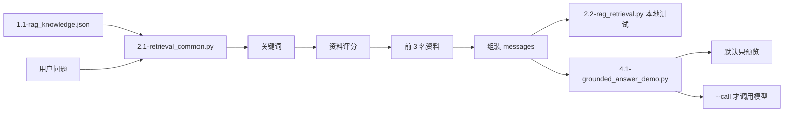

# 第 4 课 RAG 核心代码阅读笔记

## 阅读目标

当前只需要理解数据流和函数职责，不要求逐行掌握所有 Python 语法。

```text
必须理解：输入、输出、调用顺序、失败位置
暂时忽略：完整正则语法、argparse 细节、getattr、复杂推导式
```

## 文件职责

| 文件 | 职责 |
|---|---|
| `2.1-retrieval_common.py` | 提供公共检索能力：读取资料、提取关键词、打分、取前几名、组装提示词 |
| `2.2-rag_retrieval.py` | 使用公共检索能力测试 5 个问题，并把结果写入 JSON |
| `4.1-grounded_answer_demo.py` | 本地预览最终提示词；只有传入 `--call` 才调用模型 |
| `1.2-chunking_demo.py` | 演示如何按章节把长制度切分成片段 |

## 调用关系



## 公共函数

| 函数 | 输入 | 输出 | 作用 |
|---|---|---|---|
| `normalize(text)` | 原始文本 | 去空白并转小写的文本 | 统一比较格式 |
| `load_knowledge_data()` | 默认 JSON 路径 | 知识库字典 | 读取资料 |
| `extract_query_terms(question)` | 用户问题 | 关键词列表 | 从问题中找领域词 |
| `score_document(terms, doc)` | 关键词和资料 | 数字分数 | 标题命中乘 4，正文命中乘 1 |
| `retrieve(question, docs, top_k=3)` | 问题和全部资料 | 关键词及前几名资料 | 完成本地检索 |
| `build_grounded_messages(question, docs)` | 问题和召回资料 | `messages` 列表 | 组装 system 和 user 提示词 |

## 三个文件的数据流

### 第 1 步：读取资料

```text
1.1-rag_knowledge.json
→ load_knowledge_data()
→ documents 列表
```

### 第 2 步：检索

```text
用户问题
→ extract_query_terms()
→ score_document()
→ 按分数排序
→ 选择 top_k 资料
```

### 第 3 步：组装提示词

```text
system：回答规则和 JSON 格式
user：召回资料 + 当前问题
→ messages 列表
```

### 第 4 步：运行方式

```text
2.2-rag_retrieval.py
→ 本地测试 5 个问题
→ 保存 2.3-rag_retrieval_results.json
→ 不调用模型

4.1-grounded_answer_demo.py
→ 默认本地预览 3.1-grounded_prompt_preview.json
→ 不调用模型

4.1-grounded_answer_demo.py --call
→ 只调用一次模型
→ 保存 4.2-grounded_answer_smoke.json
→ 记录 token
```

## 当前必须能回答的 7 个问题

1. 原始资料从哪里读取？
2. 用户问题如何变成关键词？
3. 为什么标题命中权重是 4，正文是 1？
4. 为什么只选择前几名资料？
5. 检索资料如何进入 `messages`？
6. 为什么默认脚本不调用模型？
7. 为什么回答需要校验 `used_sources`？

## 暂时可以忽略的语法

- `argparse.ArgumentParser`
- `Path(__file__).resolve().parent`
- `getattr(...)`
- 列表推导式
- 生成器表达式
- `raise ... from`
- 完整正则表达式语法

这些属于工程实现细节，后续项目阶段再逐步掌握。
